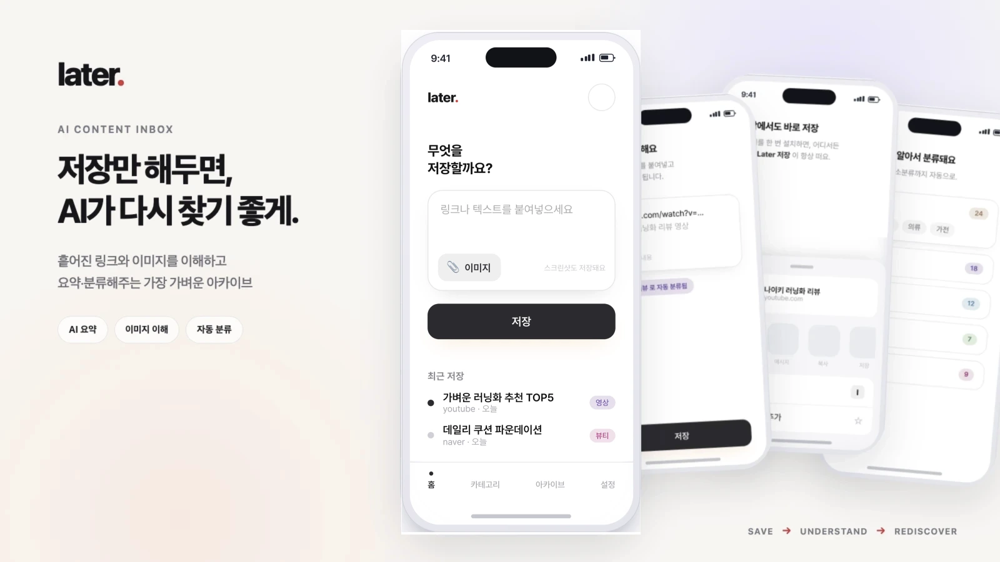
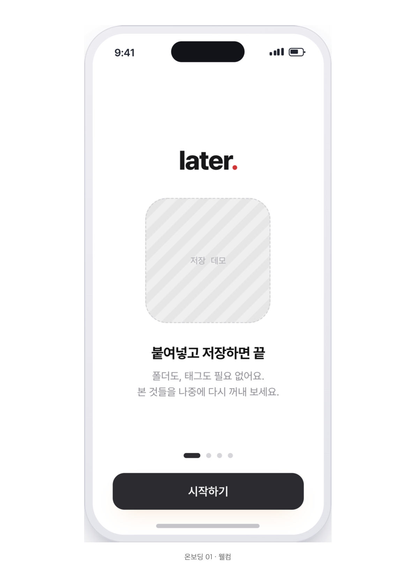
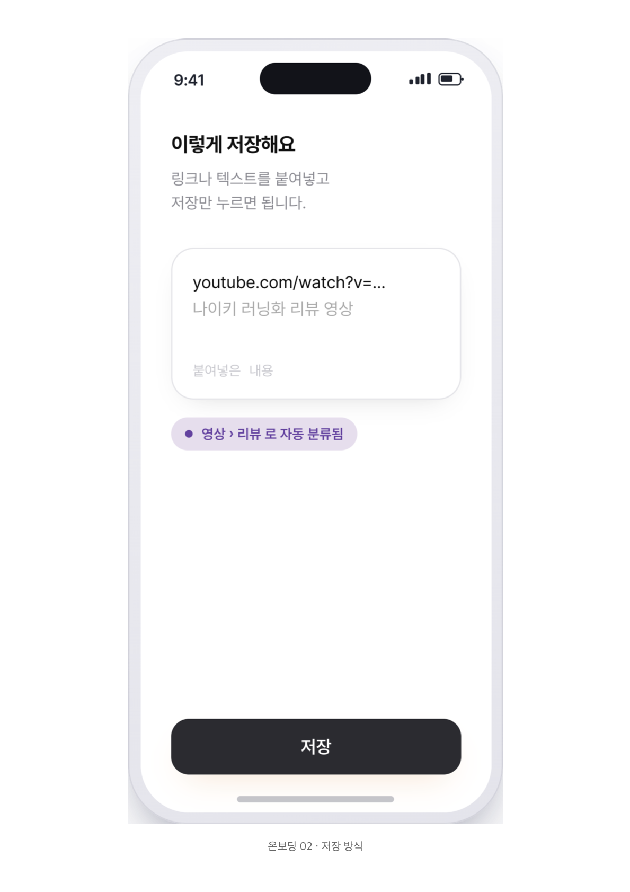
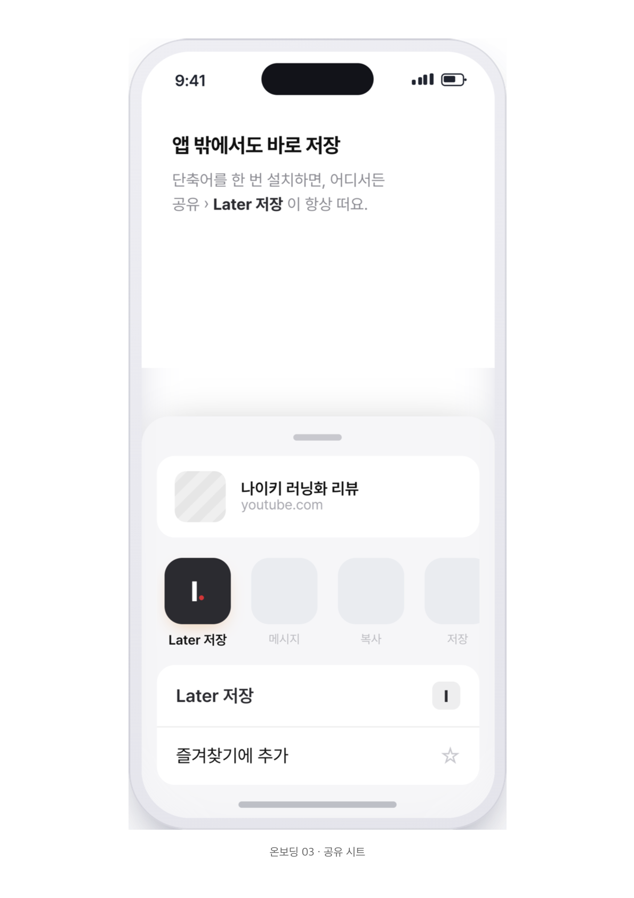
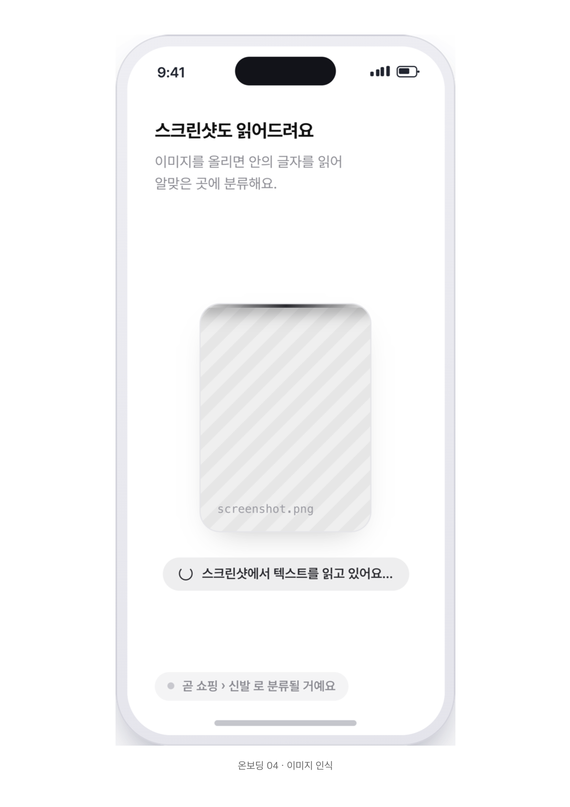
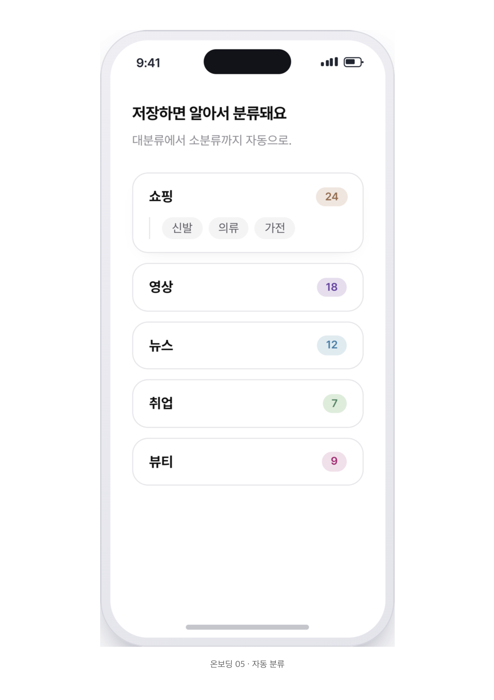
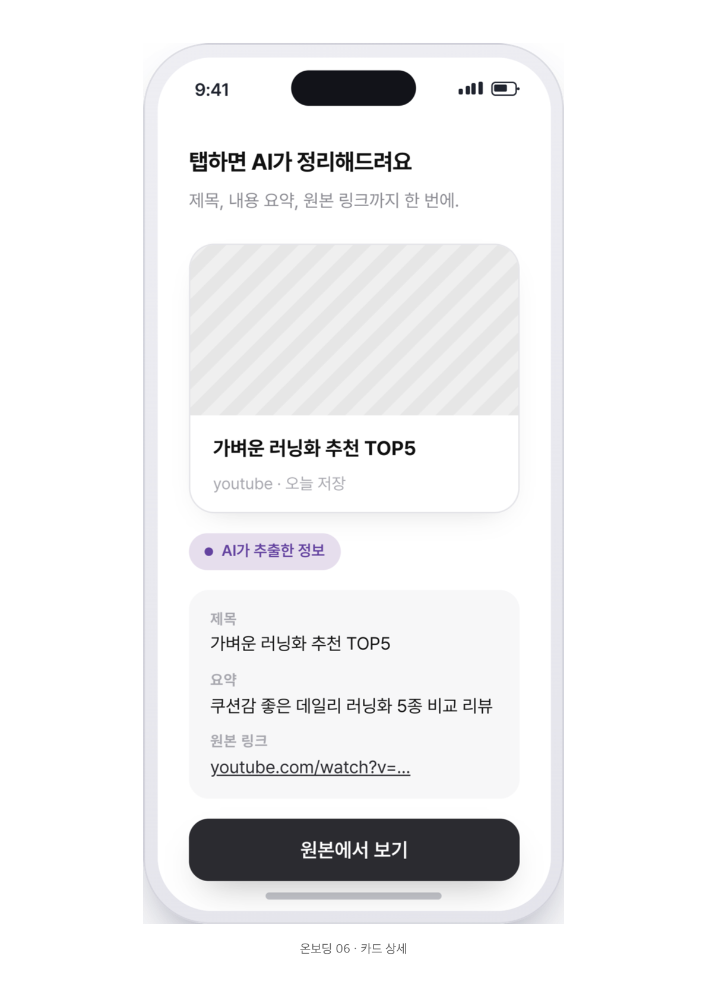
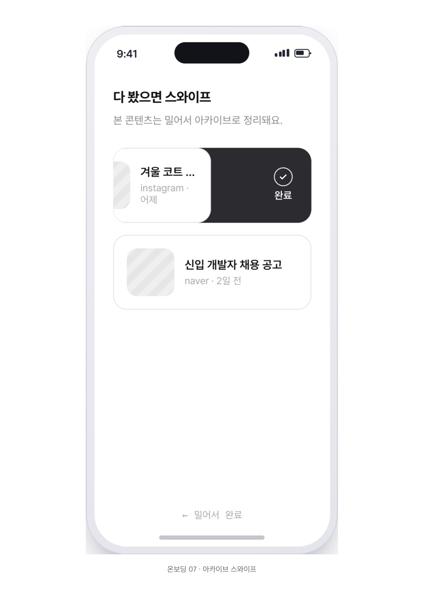
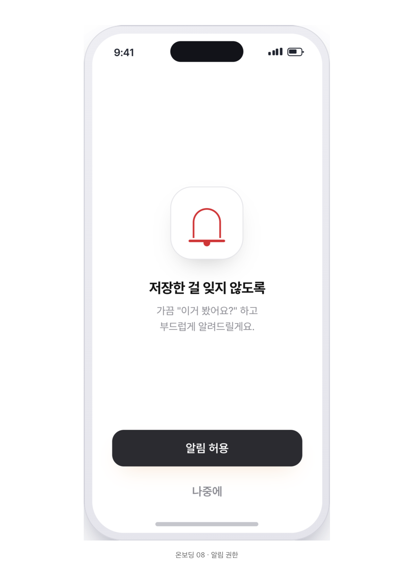
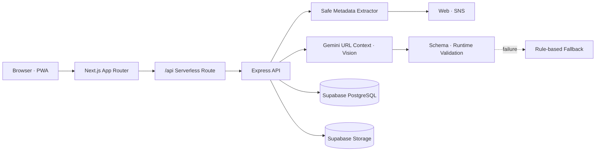

# Later

> 저장만 해두면, AI가 다시 찾기 좋게.

<p align="center">
  
</p>

<p align="center">
  <a href="https://later-theta-fawn.vercel.app"><strong>서비스 사용하기</strong></a>
  ·
  <a href="https://youtu.be/XdP8OuCMOWs"><strong>데모 영상</strong></a>
  ·
  <a href="docs/SHOWCASE.md"><strong>프로젝트 소개</strong></a>
</p>

Later는 웹과 SNS에서 발견한 URL·텍스트·이미지를 저장하면 Gemini가 내용을 분석해
한국어 제목, 핵심 요약과 카테고리를 생성하는 AI 콘텐츠 인박스입니다. 흩어진 정보를
저장하는 데서 끝내지 않고, 검색·분류·아카이브를 통해 필요한 순간에 다시 찾는 경험을
제공합니다.

## Why Later?

브라우저 북마크, 메신저, SNS 저장함과 스크린샷에는 유용한 정보가 계속 쌓이지만,
시간이 지나면 무엇을 왜 저장했는지 기억하기 어렵습니다. Later는 저장 순간에 콘텐츠의
맥락을 구조화해 **저장 비용은 낮추고 재발견 가능성은 높이는 것**을 목표로 합니다.

```text
Save                 Understand                    Rediscover
URL · Text · Image → Title · Summary · Category → Search · Filter · Archive
```

## Onboarding Flow

Later의 온보딩은 사용자가 별도의 정리 규칙을 배우지 않아도 **저장 → AI 이해 → 자동 분류
→ 재발견**의 가치를 짧은 흐름 안에서 이해하도록 설계했습니다.

<table>
  <tr>
    <td align="center" width="25%">
      
      <br /><strong>1. Welcome</strong><br />서비스가 해결하는 문제를 소개합니다.
    </td>
    <td align="center" width="25%">
      
      <br /><strong>2. Save</strong><br />링크·텍스트·이미지를 한곳에 저장합니다.
    </td>
    <td align="center" width="25%">
      
      <br /><strong>3. Share</strong><br />발견한 콘텐츠를 저장 흐름으로 연결합니다.
    </td>
    <td align="center" width="25%">
      
      <br /><strong>4. Understand</strong><br />텍스트와 이미지의 맥락을 함께 이해합니다.
    </td>
  </tr>
  <tr>
    <td align="center" width="25%">
      
      <br /><strong>5. Classify</strong><br />AI가 제목·요약·카테고리를 생성합니다.
    </td>
    <td align="center" width="25%">
      
      <br /><strong>6. Review</strong><br />핵심 요약과 원문을 함께 확인합니다.
    </td>
    <td align="center" width="25%">
      
      <br /><strong>7. Rediscover</strong><br />검색하고, 다 본 콘텐츠는 아카이브합니다.
    </td>
    <td align="center" width="25%">
      
      <br /><strong>8. Remind</strong><br />저장한 정보를 다시 볼 시점을 안내합니다.
    </td>
  </tr>
</table>

> 리마인더 알림과 OS 공유 시트 연동은 온보딩에 제시된 제품 방향이며, 현재 운영
> 버전에서는 후속 로드맵으로 관리합니다.

## Features

### Capture

- URL과 일반 텍스트를 하나의 입력 흐름으로 저장
- JPEG·PNG·WebP 이미지 업로드 및 멀티모달 분석
- YouTube·Instagram·X·Naver 등 출처 자동 인식
- 설치 가능한 PWA 지원

### Understand

- Gemini 기반 한국어 제목·핵심 요약 생성
- 대분류·소분류 자동 생성
- URL Context, 공개 웹 메타데이터와 이미지 inline data 결합
- Structured Output과 런타임 검증을 이용한 AI 응답 검증
- Gemini 실패 시 규칙 기반 제목·분류·요약 fallback

### Rediscover

- 제목·요약·원문·출처·카테고리 통합 검색
- 대분류·소분류 필터와 카테고리별 항목 집계
- 카드 상세에서 AI 요약과 원문 링크 확인
- 스와이프 아카이브, 복원과 영구 삭제
- YouTube·Instagram·X 등 출처 아이콘과 사이트명 표시

> 리마인더 알림, 공유 시트, 로그인과 사용자별 데이터 격리는 제품 로드맵에 포함된
> 기능이며 현재 운영 버전에는 포함되지 않습니다.

## Architecture

운영 환경에서는 Next.js UI와 Express API가 하나의 Vercel 프로젝트에서 같은 origin으로
동작합니다. API와 외부 서비스 키는 브라우저에 노출하지 않고 서버에서만 사용합니다.



### Save pipeline

1. `POST /api/items`에서 JSON 또는 multipart 입력을 검증합니다.
2. URL의 hostname을 기준으로 출처를 판별합니다.
3. HTTP(S), DNS, 사설 IP, redirect, timeout, 응답 크기와 Content-Type을 검증한 뒤
   공개 메타데이터를 수집합니다.
4. Gemini가 텍스트, URL Context, 메타데이터와 선택적인 이미지 데이터를 분석합니다.
5. 제목·핵심 요약·대분류·소분류 결과를 스키마와 런타임 규칙으로 다시 검증합니다.
6. AI 요청이 실패하거나 결과가 유효하지 않으면 규칙 기반 fallback으로 저장 흐름을
   유지합니다.
7. 이미지 파일은 Supabase Storage에, 원문과 분석 결과는 PostgreSQL에 저장합니다.

자세한 설계와 장애 처리 방식은 [서비스 아키텍처 문서](docs/SERVICE_ARCHITECTURE.md)에서
확인할 수 있습니다.

## Tech Stack

| Layer | Technologies |
| --- | --- |
| Frontend | Next.js 14 App Router, React 18, TypeScript, Tailwind CSS |
| API | Express 5, Vercel Serverless Function, Multer |
| AI | Gemini API, URL Context, Structured Output, multimodal inline data |
| Data | Supabase PostgreSQL, Supabase Storage |
| Testing | Vitest, React Testing Library, Supertest, JSDOM |
| Delivery | Vercel, PWA (`next-pwa`) |

## Getting Started

### Prerequisites

- Node.js `24.x`
- npm
- Supabase project
- Gemini API key

### 1. Install

```bash
git clone https://github.com/jennienn/hub.git
cd hub
npm install
```

### 2. Configure environment variables

클라이언트와 API 서버의 예제 파일을 복사합니다.

```bash
cp .env.local.example .env.local
cp server/.env.example server/.env
```

`server/.env`에 다음 값을 설정합니다.

```env
PORT=4000
CLIENT_ORIGIN=http://localhost:3000
SUPABASE_URL=
SUPABASE_SERVICE_ROLE_KEY=
SUPABASE_STORAGE_BUCKET=later-images
GEMINI_API_KEY=
GEMINI_MODEL=
```

로컬에서 Next.js와 Express를 분리 실행할 때 `.env.local`은 다음 API 주소를 사용합니다.

```env
NEXT_PUBLIC_API_BASE_URL=http://localhost:4000
```

운영 Vercel에서는 `/api/[...path]`가 Express 앱을 같은 origin에서 실행하므로
`NEXT_PUBLIC_API_BASE_URL`을 비워 둘 수 있습니다.

> `SUPABASE_SERVICE_ROLE_KEY`와 `GEMINI_API_KEY`는 서버 전용입니다. 저장소에 커밋하거나
> `NEXT_PUBLIC_*` 환경변수로 노출하지 마세요.

### 3. Apply database migrations

다음 migration을 생성 순서대로 적용합니다.

```text
supabase/migrations/202607230001_add_item_images.sql
supabase/migrations/202607230002_add_item_summary.sql
supabase/migrations/202607260001_add_item_archive.sql
```

이미지는 최대 5MB까지 허용되며 Storage bucket의 기본 이름은 `later-images`입니다.

### 4. Run locally

터미널 두 개에서 UI와 API를 실행합니다.

```bash
# Terminal 1 — Next.js
npm run dev

# Terminal 2 — Express API
npm run dev:server
```

- Web: <http://localhost:3000>
- API health check: <http://localhost:4000/api/health>

## API Overview

| Method | Endpoint | Description |
| --- | --- | --- |
| `GET` | `/api/health` | 서버 상태 확인 |
| `GET` | `/api/items?archived=true\|false` | 보관 상태별 항목 조회 |
| `POST` | `/api/items` | URL·텍스트·이미지 분석 및 저장 |
| `PATCH` | `/api/items/:id` | 항목 제목 수정 |
| `PATCH` | `/api/items/:id/archive` | 아카이브 또는 복원 |
| `DELETE` | `/api/items/:id` | 항목과 연결 이미지 삭제 |

```bash
curl -X POST http://localhost:4000/api/items \
  -H 'Content-Type: application/json' \
  -d '{"content":"https://example.com/article"}'
```

이미지 저장은 `multipart/form-data`의 `image` 필드를 사용합니다. 전체 요청·응답 형식과
상태 코드는 [API 명세](api.md)를 참고하세요.

## Project Structure

```text
.
├── app/                     # Next.js 화면과 UI 컴포넌트
│   ├── page.tsx             # 저장 홈
│   ├── categories/          # 분류·검색
│   └── archive/             # 아카이브·복원·삭제
├── lib/                     # 클라이언트 데이터와 이미지 유틸리티
├── pages/api/[...path].ts   # Vercel API bridge
├── server/
│   ├── index.ts             # Express CRUD API
│   ├── metadata.ts          # 메타데이터 수집과 SSRF 방어
│   ├── geminiClassification.ts
│   ├── classification.ts    # 규칙 기반 fallback
│   └── imageStorage.ts      # Supabase Storage 처리
├── supabase/migrations/     # 데이터베이스 변경 이력
├── showcase/                # 쇼케이스 데이터와 이미지
└── docs/                    # 설계·배포·개발 문서
```

## Testing and Validation

```bash
# Unit, component and API tests
npm test

# TypeScript
npx tsc --noEmit

# Production build
npm run build

# Whitespace and patch validation
git diff --check
```

테스트는 분류 fallback, Gemini 응답 검증, 메타데이터 보안, 이미지 저장, API 오류 처리와
주요 UI 동작을 포함합니다.

`npm run lint`는 현재 저장소에 명시적인 ESLint 구성 파일이 없어 Next.js 초기 설정
프롬프트를 표시합니다. CI에서 lint를 사용하려면 먼저 ESLint 구성을 추가해야 합니다.

## Security and Platform Limits

- URL 메타데이터 요청에 사설 IP 차단, redirect 재검증, timeout, 응답 크기와 형식 제한을
  적용합니다.
- AI 출력은 신뢰하지 않고 스키마와 허용값을 별도로 검증합니다.
- service-role key와 Gemini key는 서버에서만 사용합니다.
- 플랫폼이 공개한 정보만 분석합니다. 로그인 우회, 비공개 콘텐츠 수집과 크롤링 제한
  회피는 지원하지 않습니다.
- Instagram Reel처럼 영상 원문을 공개하지 않는 경우 캡션과 공개 메타데이터 범위에서만
  요약합니다.
- 현재 데이터 모델에는 사용자 소유권 필드와 인증이 없습니다. 공개 다중 사용자 서비스로
  확장하기 전 인증, 소유권 컬럼과 Supabase RLS를 추가해야 합니다.

## Deployment

Vercel Production 배포 전 다음 항목을 확인합니다.

```bash
npm test
npx tsc --noEmit
npm run build
```

Vercel에는 `SUPABASE_URL`, `SUPABASE_SERVICE_ROLE_KEY`, `SUPABASE_STORAGE_BUCKET`,
`GEMINI_API_KEY`, `GEMINI_MODEL`을 서버 환경변수로 등록합니다. 자세한 절차와 검증 기준은
[배포 워크플로 문서](docs/DEPLOYMENT_WORKFLOW.md)를 참고하세요.

## Documentation

- [API specification](api.md)
- [Service architecture](docs/SERVICE_ARCHITECTURE.md)
- [Deployment workflow](docs/DEPLOYMENT_WORKFLOW.md)
- [AI development workflow](docs/AI_DEVELOPMENT_WORKFLOW.md)
- [Showcase overview](docs/SHOWCASE.md)
- [Product plan](docs/plan.md)
- [Completion checklist](docs/checklist.md)
- [Backlog](docs/task.md)

## Current Status

Later는 저장·AI 분석·검색·분류·아카이브와 PWA 설치를 제공하는 운영 가능한 데모입니다.
다음 단계는 사용자 인증과 데이터 격리, 리마인더 알림, 공유 시트 연동입니다.
